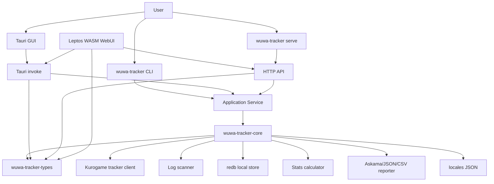

# Wuwa Tracker Design

- Updated Date: 2026-09-30

## Architecture Overview

Wuwa Tracker는 Rust workspace와 Leptos CSR WebUI로 구성된 local-first 트래커입니다. 기본 실행은 Tauri GUI이며, `serve` subcommand는 기본적으로 API-only HTTP server를 실행합니다. `serve --webui`는 빌드 시 바이너리에 embed된 WebUI asset을 같은 서버에서 함께 제공합니다.

## Component Details

### Workspace

- `crates/wuwa-tracker-types`: core, app, WebUI가 함께 사용하는 도메인 모델과 Serde 기반 API 응답 계약을 제공합니다. 캐릭터별 집계 함수 `character_summaries`는 `crates/wuwa-tracker-core/src/characters.rs`에 있으며, app service가 통계 응답의 `characterSummaries`에 집계 결과를 포함하고 WebUI는 이를 표시합니다. WASM에서도 사용할 수 있도록 Serde 외의 runtime 의존성을 두지 않습니다. 근거: `crates/wuwa-tracker-types/src/lib.rs`, `crates/wuwa-tracker-types/Cargo.toml`.
- `crates/wuwa-tracker-core`: 설정, Kurogame API client, 로그 URL 스캐너, 기록 병합, redb 저장소, 통계 계산, 리포트 export, 번역 로딩 같은 도메인 부품을 담당합니다. 리포트 출력 형식인 `ReportFormat`은 `reporter` module이 소유합니다. 근거: `crates/wuwa-tracker-core/src/store.rs`, `crates/wuwa-tracker-core/src/reporter.rs`.
- `crates/wuwa-tracker-app`: `wuwa-tracker` GUI binary, `wuwa-tracker-cli` CLI/server binary, application service layer를 제공합니다. Tauri GUI, Axum HTTP server, CLI subcommand를 같은 app service 위에서 실행합니다.
- `crates/wuwa-tracker-webui`: Leptos CSR UI를 `wasm32-unknown-unknown`으로 컴파일합니다. Tauri runtime에서는 global `invoke` API를 사용하고, Trunk 개발 서버에서는 HTTP API를 사용합니다.
- `locales`: game locale fallback과 UI locale JSON입니다.

### Runtime Modes

- GUI: `make run` 또는 `cargo run -p wuwa-tracker`
- API server: `make serve` 또는 `cargo run -p wuwa-tracker --no-default-features --bin wuwa-tracker-cli -- serve --host 127.0.0.1 --port 3000`
- Fullstack server: `make serve WEBUI=1` 또는 `cargo run -p wuwa-tracker --no-default-features --bin wuwa-tracker-cli -- serve --webui`
- CLI: `cargo run -p wuwa-tracker --no-default-features --bin wuwa-tracker-cli -- <command> [args]`

지원 CLI command:

- `version`
- `scan`
- `report`
- `run`
- `autorun`
- `config show`
- `config set <key> <value>`
- `config clear`
- `backup`
- `merge`
- `db stats`
- `db players`
- `db stats <player-id>`
- `db banners <player-id>`
- `db characters <player-id>`
- `serve`

`autorun`은 로그를 주기적으로 스캔하고 URL이 바뀌면 기록 조회 및 리포트 생성을 수행합니다. CLI 기본값은 `~/.wuwa-tracker/settings.json`에 저장하며 명령 인자, 저장된 설정, 기본값 순서로 적용합니다. 근거: `crates/wuwa-tracker-app/src/lib.rs`, `crates/wuwa-tracker-app/src/cli.rs`, `crates/wuwa-tracker-app/src/settings.rs`, `crates/wuwa-tracker-core/src/config.rs`.

### Data Flow

Online track flow:

1. GUI/WebUI/CLI가 gacha URL을 입력받습니다.
2. `tracker::TrackerClient`가 URL query 또는 fragment query에서 payload를 파싱합니다.
3. 설정된 banner type을 순회하며 Kurogame `/gacha/record/query` API를 호출합니다.
4. App service가 결과를 redb store에 병합 저장합니다.
5. `StatsCalculator`가 pity, 5성 이력, Luck Score를 계산합니다.

Offline upload/report flow:

1. `FetchResult` JSON 또는 legacy `map<string, Record[]>` JSON을 읽습니다.
2. player ID를 payload 또는 파일명에서 결정합니다.
3. redb store에 병합 저장한 뒤 같은 stats/report path를 사용합니다. legacy JSON 파일 해석은 CLI 파일 로딩 경로에서 지원하며, HTTP upload는 `FetchResult`를 받습니다. 근거: `crates/wuwa-tracker-app/src/service.rs`, `crates/wuwa-tracker-app/src/http.rs`.

### Persistence

기본 저장소는 `~/.wuwa-tracker/store.redb`입니다. `RedbStore`는 `records` 테이블에 player ID와 banner key를 NUL 문자로 연결한 키와 postcard로 직렬화한 기록 배열을 저장합니다. 배너 갱신은 write transaction으로 반영합니다. 근거: `crates/wuwa-tracker-core/src/config.rs`, `crates/wuwa-tracker-core/src/store.rs`.

병합 전략:

1. 신규 기록 suffix와 기존 기록 prefix의 sequence overlap matching
2. overlap이 없으면 시간대 기준 앞/뒤 append
3. 시간대가 교차하면 시간 기반 union merge

`backup`은 redb 데이터를 `players -> player ID -> banner key -> Record[]` 구조의 JSON으로 export합니다. `merge`는 이 JSON 백업을 읽어 기존 기록과 병합한 뒤 하나의 transaction으로 반영합니다. 근거: `crates/wuwa-tracker-core/src/store.rs`. 기존 `store.json`을 자동 이관하는 경로는 현재 없습니다.

### Logging

기본 application log 경로는 `~/.wuwa-tracker/wuwa-tracker.log`이며 `WUWA_TRACKER_LOG_PATH` 또는 CLI `--logpath`로 변경할 수 있습니다. App service layer는 `tracing` event를 발생시키고, app binary가 콘솔 subscriber와 rotating JSON Lines file subscriber를 초기화합니다. 기본 filter는 일반 CLI 콘솔에서 ERROR, `serve` 콘솔과 파일 및 GUI runtime에서 INFO입니다. `RUST_LOG`와 `WUWA_TRACKER_LOG_LEVEL`은 `EnvFilter` directive로 runtime filter를 재정의하며, 둘 다 존재하면 `RUST_LOG`가 우선합니다. `serve` mode는 Axum middleware로 HTTP method, path, status, duration, user agent를 기록합니다. Log file은 10 MiB 기준으로 rotation되며 최대 10개까지 보관합니다.

### Reporting

- HTML: `askama` template인 `crates/wuwa-tracker-core/templates/report.html`을 컴파일 타임에 검증하고 렌더링합니다.
- JSON: `ReportData` pretty JSON
- CSV: 기록 단위 flat CSV

### HTTP API

기본 `serve` mode는 WebUI static asset을 제공하지 않고 다음 API route만 제공합니다.

- `POST /api/track`
- `POST /api/scan`
- `POST /api/upload`
- `GET /api/stats/{player_id}`
- `GET /api/players`
- `GET /api/config`
- `GET /api/i18n`
- `GET /api/export/{player_id}`
- `GET /api/backup`

`serve --webui`는 `/api/*` route를 유지하면서 나머지 경로에서 바이너리에 embed된 WebUI 정적 파일을 제공합니다. GUI mode는 같은 기능을 Tauri command로 호출합니다.

Route 정의 근거: `crates/wuwa-tracker-app/src/http.rs`.

## Notes

- Leptos `wuwa-tracker-webui`가 Tauri GUI의 기본 frontend이며, Trunk가 WASM과 loader JavaScript를 생성합니다.
- CLI `serve`는 기본적으로 API-only 모드이며, `--webui`를 지정한 경우에만 루트 또는 비 API 경로에 WebUI를 노출합니다.
- HTML 리포트는 Askama template로 렌더링합니다.
